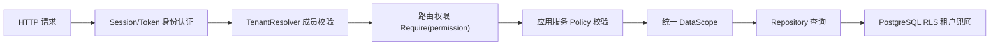
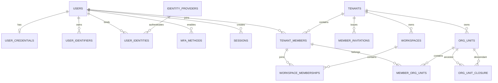
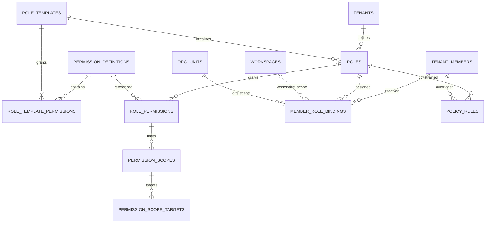
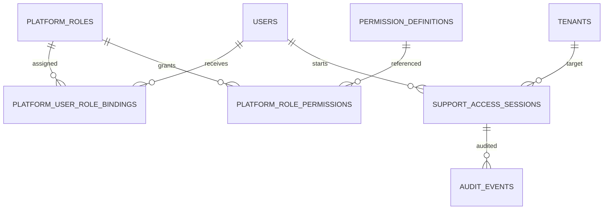
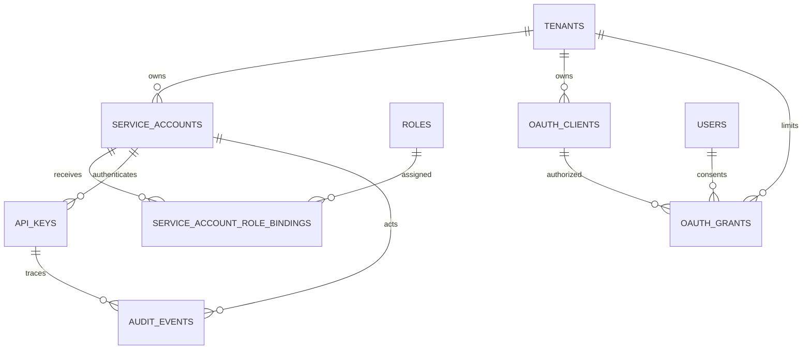
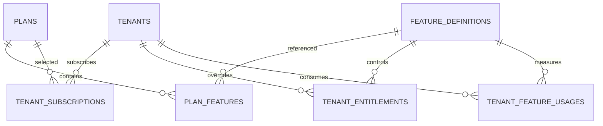

# 多租户权限管理与鉴权模型设计

## 1. 文档目标

本文定义 ASaaS 平台的身份认证、租户成员、组织、工作区、角色权限、数据权限、平台管理、开放 API、套餐能力和审计模型。

整体方案采用：

- 用户账号与租户成员分离。
- 平台权限与租户权限分离。
- RBAC 决定“能做什么”。
- Data Scope 决定“能访问哪些数据”。
- ABAC 只负责额外约束和显式拒绝。
- PostgreSQL RLS 负责租户隔离兜底。
- Session、服务账号和开放 API 使用统一授权语义。

本文中的模型是逻辑模型。具体迁移脚本应根据模块开发顺序分批创建，不建议在一个迁移中一次性创建全部对象。

---

## 2. 设计原则

### 2.1 默认拒绝

任何没有被显式授予的操作都必须拒绝。新增接口如果没有登记权限编码，不允许上线。

### 2.2 身份与成员分离

`User` 表示全局自然人账号，`TenantMember` 表示用户在某个租户中的成员身份。

因此：

- 一个用户可以加入多个租户。
- 同一用户可以在不同租户拥有不同角色。
- 用户锁定会影响全部租户。
- 成员禁用只影响当前租户。

### 2.3 功能权限与数据权限分离

角色权限回答“是否允许读取客户”，数据范围回答“允许读取哪些客户”。

例如：

- 销售和销售经理都拥有 `crm.customer.read`。
- 销售的数据范围是 `SELF`。
- 销售经理的数据范围是 `DEPARTMENT_AND_CHILDREN`。

### 2.4 平台与租户安全域分离

平台管理员不能通过一个全局 `super_admin` 角色直接绕过所有租户条件。平台人员访问租户业务数据时，必须建立限时、可审计的租户代操作会话。

### 2.5 数据库事实来源

PostgreSQL 是账号、成员、角色、权限和会话的事实来源。Redis 只用于会话加速、权限快照、限流和缓存失效。

### 2.6 多层防御

授权必须同时覆盖：

1. 路由权限。
2. 应用服务业务策略。
3. Repository 数据范围。
4. PostgreSQL 租户 RLS。
5. 缓存、对象存储、异步任务中的租户命名空间。

---

## 3. 领域划分

建议将权限相关能力划分为以下模块：

```text
identity        全局账号、登录身份、密码、MFA、会话
tenant          租户、成员、邀请、工作区
organization    组织树、部门、成员归属
iam             权限、角色、角色绑定、数据范围、ABAC
platform        平台管理员、租户代操作
integration     身份提供商、服务账号、API Key、OAuth
entitlement     套餐、功能开通、配额
audit           登录、授权、敏感操作审计
```

建议目录：

```text
internal/modules/
├── identity/
├── tenant/
├── organization/
├── iam/
├── platform/
├── integration/
├── entitlement/
└── audit/
```

---

## 4. 总体鉴权链路



各层职责：

- 身份认证：判断用户或服务账号是谁，凭据是否有效。
- 租户认证：判断主体是否属于当前租户和工作区。
- 功能授权：判断主体能否执行指定业务动作。
- 数据授权：判断主体能操作哪些记录和字段。
- 业务校验：判断目标对象当前状态是否允许执行动作。

---

## 5. 账号、租户与组织模型



### 5.1 `users`：全局用户账号

表示一个自然人账号，不包含任何租户角色。

| 字段 | 类型 | 说明 |
| --- | --- | --- |
| `id` | UUID PK | 用户 ID |
| `display_name` | varchar | 显示名称 |
| `avatar_url` | text | 头像地址 |
| `locale` | varchar | 默认语言 |
| `timezone` | varchar | 默认时区 |
| `status` | enum | `active/locked/deleted` |
| `security_version` | bigint | 密码修改、全局封禁时递增 |
| `locked_at` | timestamptz | 锁定时间 |
| `created_at` | timestamptz | 创建时间 |
| `updated_at` | timestamptz | 更新时间 |
| `deleted_at` | timestamptz | 逻辑删除时间 |

关系：

- 一个用户可以拥有多个邮箱或手机号。
- 一个用户可以绑定多个第三方登录身份。
- 一个用户可以加入多个租户。
- 用户被锁定时，所有租户访问都失效。
- 用户被锁定不等于删除租户成员记录。

### 5.2 `user_identifiers`：登录标识

保存邮箱、手机号、用户名等可用于查找用户的标识。

| 字段 | 类型 | 说明 |
| --- | --- | --- |
| `id` | UUID PK | 标识 ID |
| `user_id` | UUID FK | 所属用户 |
| `kind` | enum | `email/phone/username` |
| `value` | varchar | 原始值 |
| `normalized_value` | varchar | 标准化后的值 |
| `verified_at` | timestamptz | 验证时间 |
| `is_primary` | boolean | 是否主标识 |
| `created_at` | timestamptz | 创建时间 |

约束：

```text
UNIQUE(kind, normalized_value)
```

邮箱应转小写并执行规范化；手机号统一保存为 E.164 格式。第三方登录不能仅凭未验证邮箱自动合并账号。

### 5.3 `user_credentials`：本地密码凭据

与 `users` 一对一，仅本地密码登录用户需要。

| 字段 | 类型 | 说明 |
| --- | --- | --- |
| `user_id` | UUID PK/FK | 用户 ID |
| `password_hash` | text | Argon2id 哈希 |
| `password_algorithm` | varchar | 算法及版本 |
| `password_changed_at` | timestamptz | 最近修改时间 |
| `failed_attempts` | integer | 连续失败次数 |
| `locked_until` | timestamptz | 临时锁定截止时间 |
| `must_change_password` | boolean | 是否强制修改密码 |
| `updated_at` | timestamptz | 更新时间 |

`failed_attempts` 可以在 Redis 中高速计数，但数据库需要保存最终锁定状态。

### 5.4 `identity_providers`：身份提供商

表示企业微信、飞书、钉钉、OIDC、GitHub、Google 等身份源连接。

| 字段 | 类型 | 说明 |
| --- | --- | --- |
| `id` | UUID PK | 身份源 ID |
| `tenant_id` | UUID nullable | 空表示平台公共身份源 |
| `provider_type` | enum | `oidc/wecom/feishu/dingtalk/github/google` |
| `name` | varchar | 显示名称 |
| `issuer` | varchar | OIDC Issuer |
| `client_id` | varchar | Client ID |
| `secret_ref` | varchar | Secret Manager 引用 |
| `config` | jsonb | 非敏感配置 |
| `status` | enum | `active/disabled` |
| `created_at` | timestamptz | 创建时间 |

敏感的 Client Secret 不直接保存在表中，只保存 Secret Manager 引用。

### 5.5 `user_identities`：第三方身份绑定

| 字段 | 类型 | 说明 |
| --- | --- | --- |
| `id` | UUID PK | 绑定 ID |
| `user_id` | UUID FK | 平台用户 |
| `provider_id` | UUID FK | 身份提供商 |
| `provider_subject` | varchar | 第三方唯一用户 ID |
| `email_snapshot` | varchar | 登录时邮箱快照 |
| `profile_snapshot` | jsonb | 最小必要资料 |
| `bound_at` | timestamptz | 绑定时间 |
| `last_login_at` | timestamptz | 最近登录时间 |

约束：

```text
UNIQUE(provider_id, provider_subject)
```

一个第三方身份只能绑定一个平台用户。

### 5.6 `mfa_methods`：多因素认证

| 字段 | 类型 | 说明 |
| --- | --- | --- |
| `id` | UUID PK | MFA 方法 ID |
| `user_id` | UUID FK | 用户 |
| `method_type` | enum | `totp/webauthn/recovery_code` |
| `name` | varchar | 设备名称 |
| `secret_ref` | varchar | 加密密钥引用 |
| `credential_data` | jsonb | WebAuthn 公钥等信息 |
| `status` | enum | `active/revoked` |
| `verified_at` | timestamptz | 验证时间 |
| `last_used_at` | timestamptz | 最近使用时间 |

平台管理员、租户 Owner 和高风险操作建议强制 MFA。

### 5.7 `sessions`：登录会话

第一方 Web/Admin 的主要认证模型。

| 字段 | 类型 | 说明 |
| --- | --- | --- |
| `id` | UUID PK | 内部会话 ID |
| `user_id` | UUID FK | 用户 |
| `token_hash` | bytea UNIQUE | Cookie 随机令牌哈希 |
| `security_version` | bigint | 创建时用户安全版本 |
| `authn_level` | enum | `password/mfa/sso` |
| `device_id` | varchar | 设备标识 |
| `device_name` | varchar | 设备名称 |
| `ip_created` | inet | 登录 IP |
| `ip_last` | inet | 最近 IP |
| `user_agent_hash` | varchar | User-Agent 摘要 |
| `tenant_hint` | UUID nullable | 最近租户，仅作提示 |
| `status` | enum | `active/revoked/expired` |
| `issued_at` | timestamptz | 签发时间 |
| `last_seen_at` | timestamptz | 最近使用时间 |
| `idle_expires_at` | timestamptz | 空闲过期时间 |
| `absolute_expires_at` | timestamptz | 绝对过期时间 |
| `revoked_at` | timestamptz | 吊销时间 |
| `revoke_reason` | varchar | 吊销原因 |

关系与规则：

- Session 只证明用户身份，不证明用户属于某个租户。
- `tenant_hint` 不能作为可信租户上下文。
- 每次请求仍需验证 `tenant_members`。
- 密码修改时递增 `users.security_version`，旧 Session 自动失效。
- Cookie 只保存高熵随机值，数据库只保存其哈希。

### 5.8 `tenants`：租户

租户是计费、数据隔离和资源配额边界。

| 字段 | 类型 | 说明 |
| --- | --- | --- |
| `id` | UUID PK | 租户 ID |
| `slug` | varchar UNIQUE | 租户标识 |
| `name` | varchar | 租户名称 |
| `status` | enum | `pending/active/suspended/readonly/deleted` |
| `authz_version` | bigint | 租户权限全局版本 |
| `created_by_user_id` | UUID FK | 创建人 |
| `activated_at` | timestamptz | 激活时间 |
| `suspended_at` | timestamptz | 暂停时间 |
| `created_at` | timestamptz | 创建时间 |
| `updated_at` | timestamptz | 更新时间 |

`authz_version` 用于角色权限或全租户策略变化后的缓存整体失效。

租户状态含义：

- `active`：正常读写。
- `suspended`：禁止正常访问。
- `readonly`：只允许查询、导出和审计。
- `deleted`：等待数据清理。

### 5.9 `tenant_members`：租户成员

表示用户在某个租户中的身份。

| 字段 | 类型 | 说明 |
| --- | --- | --- |
| `id` | UUID PK | 成员 ID |
| `tenant_id` | UUID FK | 租户 |
| `user_id` | UUID FK | 用户 |
| `status` | enum | `active/disabled/removed` |
| `job_title` | varchar | 职位 |
| `employee_no` | varchar | 租户内员工编号 |
| `authz_version` | bigint | 成员权限版本 |
| `joined_at` | timestamptz | 加入时间 |
| `disabled_at` | timestamptz | 禁用时间 |
| `removed_at` | timestamptz | 移除时间 |
| `created_at` | timestamptz | 创建时间 |
| `updated_at` | timestamptz | 更新时间 |

约束：

```text
UNIQUE(tenant_id, user_id)
UNIQUE(tenant_id, id)
```

成员被禁用只影响当前租户，不影响该用户访问其他租户。

不在本表保存 `role_id`，因为一个成员可以拥有多个角色，且角色可能只在某个工作区生效。

### 5.10 `member_invitations`：成员邀请

邀请和正式成员分开，避免创建大量没有用户账号的成员记录。

| 字段 | 类型 | 说明 |
| --- | --- | --- |
| `id` | UUID PK | 邀请 ID |
| `tenant_id` | UUID FK | 租户 |
| `identifier_type` | enum | `email/phone` |
| `identifier_value` | varchar | 被邀请邮箱或手机号 |
| `token_hash` | bytea UNIQUE | 一次性令牌哈希 |
| `invited_by_member_id` | UUID FK | 邀请人 |
| `status` | enum | `pending/accepted/expired/revoked` |
| `expires_at` | timestamptz | 过期时间 |
| `accepted_by_user_id` | UUID nullable | 接受邀请的用户 |
| `accepted_at` | timestamptz | 接受时间 |
| `created_at` | timestamptz | 创建时间 |

接受邀请时，在同一事务中：

1. 校验一次性令牌。
2. 创建或查找用户。
3. 创建 `tenant_members`。
4. 创建初始角色绑定。
5. 将邀请标记为 `accepted`。
6. 写审计日志与 Outbox。

### 5.11 `workspaces`：工作区

工作区是业务协作范围，不是组织部门，也不是租户隔离边界。

| 字段 | 类型 | 说明 |
| --- | --- | --- |
| `id` | UUID PK | 工作区 ID |
| `tenant_id` | UUID FK | 所属租户 |
| `code` | varchar | 租户内编码 |
| `name` | varchar | 名称 |
| `workspace_type` | varchar | 项目、区域、事业线等 |
| `status` | enum | `active/archived` |
| `created_at` | timestamptz | 创建时间 |

约束：

```text
UNIQUE(tenant_id, code)
UNIQUE(tenant_id, id)
```

### 5.12 `workspace_memberships`：成员工作区关系

| 字段 | 类型 | 说明 |
| --- | --- | --- |
| `tenant_id` | UUID | 冗余用于同租户约束 |
| `workspace_id` | UUID FK | 工作区 |
| `member_id` | UUID FK | 租户成员 |
| `status` | enum | `active/removed` |
| `joined_at` | timestamptz | 加入时间 |

约束：

```text
PRIMARY KEY(workspace_id, member_id)

FOREIGN KEY(tenant_id, workspace_id)
    REFERENCES workspaces(tenant_id, id)

FOREIGN KEY(tenant_id, member_id)
    REFERENCES tenant_members(tenant_id, id)
```

复合外键可以从数据库层阻止跨租户关联。

### 5.13 `org_units`：组织单元

用统一树模型表达公司、事业部、部门、团队，不分别维护多套树。

| 字段 | 类型 | 说明 |
| --- | --- | --- |
| `id` | UUID PK | 组织单元 ID |
| `tenant_id` | UUID FK | 租户 |
| `parent_id` | UUID nullable | 父节点 |
| `unit_type` | enum | `organization/division/department/team` |
| `code` | varchar | 编码 |
| `name` | varchar | 名称 |
| `status` | enum | `active/disabled` |
| `manager_member_id` | UUID nullable | 负责人 |
| `created_at` | timestamptz | 创建时间 |

约束：

```text
UNIQUE(tenant_id, code)
UNIQUE(tenant_id, id)
```

`parent_id` 必须通过复合外键保证属于相同租户。

### 5.14 `org_unit_closure`：组织树闭包表

用于高效查询“本部门及所有子部门”。

| 字段 | 类型 | 说明 |
| --- | --- | --- |
| `tenant_id` | UUID | 租户 |
| `ancestor_id` | UUID FK | 祖先节点 |
| `descendant_id` | UUID FK | 后代节点 |
| `depth` | integer | 相对深度，自己为 0 |

约束：

```text
PRIMARY KEY(ancestor_id, descendant_id)
CHECK(depth >= 0)
```

创建组织单元时，应插入自身 `depth=0`，并复制父节点的全部祖先关系。

### 5.15 `member_org_units`：成员组织归属

支持一个成员属于多个组织单元，同时保留一个主部门。

| 字段 | 类型 | 说明 |
| --- | --- | --- |
| `tenant_id` | UUID | 租户 |
| `member_id` | UUID FK | 成员 |
| `org_unit_id` | UUID FK | 组织单元 |
| `relation_type` | enum | `member/manager` |
| `is_primary` | boolean | 是否主组织 |
| `joined_at` | timestamptz | 加入时间 |

约束：

```text
PRIMARY KEY(member_id, org_unit_id)
```

通过部分唯一索引保证每个成员最多一个主组织：

```sql
CREATE UNIQUE INDEX uq_member_primary_org_unit
ON member_org_units(member_id)
WHERE is_primary = true;
```

---

## 6. 权限、角色与数据范围模型



### 6.1 `permission_definitions`：原子权限定义

权限由代码注册，数据库用于查询、配置和审计。

| 字段 | 类型 | 说明 |
| --- | --- | --- |
| `code` | varchar PK | 如 `crm.customer.read` |
| `realm` | enum | `tenant/platform` |
| `module` | varchar | 如 `crm` |
| `resource` | varchar | 如 `customer` |
| `action` | varchar | 如 `read/create/update/delete/export` |
| `name` | varchar | 展示名称 |
| `description` | text | 描述 |
| `risk_level` | enum | `normal/sensitive/critical` |
| `supports_data_scope` | boolean | 是否支持数据范围 |
| `status` | enum | `active/deprecated` |
| `registered_version` | varchar | 注册版本 |
| `created_at` | timestamptz | 创建时间 |

权限编码示例：

```text
iam.member.read
iam.member.invite
iam.member.disable
iam.role.read
iam.role.update
crm.customer.read
crm.customer.create
crm.customer.update
crm.customer.delete
crm.customer.export
crm.customer.sensitive.read
workflow.instance.approve
```

规则：

- 权限编码一旦上线不可修改，只能废弃。
- 新增接口必须注册权限。
- 角色、菜单、按钮、API 文档引用同一个权限编码。
- 平台权限使用 `platform.*` 命名空间。
- 租户角色不能引用 `platform` realm 权限。

### 6.2 `role_templates`：平台角色模板

用于新租户初始化。

| 字段 | 类型 | 说明 |
| --- | --- | --- |
| `id` | UUID PK | 模板 ID |
| `code` | varchar UNIQUE | 如 `tenant_owner/sales_manager` |
| `name` | varchar | 模板名称 |
| `description` | text | 描述 |
| `is_system` | boolean | 是否系统模板 |
| `version` | bigint | 模板版本 |
| `status` | enum | `active/deprecated` |

示例：

```text
tenant_owner
tenant_admin
workspace_admin
sales_manager
sales_rep
finance
auditor
```

创建租户时将模板复制为租户角色，避免租户后续自定义直接影响全局模板。

### 6.3 `role_template_permissions`

| 字段 | 类型 | 说明 |
| --- | --- | --- |
| `role_template_id` | UUID FK | 模板 |
| `permission_code` | varchar FK | 权限 |
| `created_at` | timestamptz | 创建时间 |

主键：

```text
PRIMARY KEY(role_template_id, permission_code)
```

### 6.4 `roles`：租户角色

| 字段 | 类型 | 说明 |
| --- | --- | --- |
| `id` | UUID PK | 角色 ID |
| `tenant_id` | UUID FK | 所属租户 |
| `source_template_id` | UUID nullable | 来源模板 |
| `code` | varchar | 租户内角色编码 |
| `name` | varchar | 角色名称 |
| `description` | text | 描述 |
| `role_type` | enum | `system/custom` |
| `status` | enum | `active/disabled` |
| `version` | bigint | 乐观锁版本 |
| `created_by_member_id` | UUID FK | 创建人 |
| `created_at` | timestamptz | 创建时间 |
| `updated_at` | timestamptz | 更新时间 |

约束：

```text
UNIQUE(tenant_id, code)
UNIQUE(tenant_id, id)
```

系统 Owner 角色可以禁止删除，但其权限仍以显式记录存在，不在业务代码中使用 `role == owner` 绕过检查。

### 6.5 `role_permissions`：角色权限授权

| 字段 | 类型 | 说明 |
| --- | --- | --- |
| `id` | UUID PK | 授权 ID |
| `tenant_id` | UUID | 租户 |
| `role_id` | UUID FK | 角色 |
| `permission_code` | varchar FK | 原子权限 |
| `created_by_member_id` | UUID FK | 授权人 |
| `created_at` | timestamptz | 授权时间 |

约束：

```text
UNIQUE(role_id, permission_code)
```

RBAC 层只保存允许授权，不在这里加入 deny。显式拒绝统一由 `policy_rules` 处理。

### 6.6 `permission_scopes`：权限的数据范围

数据范围与具体角色权限绑定，而不是简单绑定角色。

示例：

```text
销售角色：
crm.customer.read   -> SELF
crm.customer.export -> 不授予

经理角色：
crm.customer.read   -> DEPARTMENT_AND_CHILDREN
crm.customer.export -> DEPARTMENT
```

字段：

| 字段 | 类型 | 说明 |
| --- | --- | --- |
| `id` | UUID PK | 范围 ID |
| `tenant_id` | UUID | 租户 |
| `role_permission_id` | UUID FK | 所属角色权限 |
| `scope_type` | enum | 数据范围 |
| `created_at` | timestamptz | 创建时间 |

`scope_type`：

```text
SELF
DEPARTMENT
DEPARTMENT_AND_CHILDREN
WORKSPACE
TENANT
CUSTOM
```

没有数据范围的操作权限，例如 `iam.member.invite`，不创建本记录。

同一个角色权限可以配置多个 Scope，多个 Scope 按并集处理。

### 6.7 `permission_scope_targets`：自定义范围目标

主要用于 `CUSTOM`，避免把目标 ID 全部放入 JSON。

| 字段 | 类型 | 说明 |
| --- | --- | --- |
| `id` | UUID PK | 目标 ID |
| `tenant_id` | UUID | 租户 |
| `scope_id` | UUID FK | 数据范围 |
| `target_type` | enum | `member/org_unit/workspace` |
| `target_member_id` | UUID nullable | 指定成员 |
| `target_org_unit_id` | UUID nullable | 指定组织 |
| `target_workspace_id` | UUID nullable | 指定工作区 |

使用 CHECK 约束保证恰好一个目标字段不为空，并与 `target_type` 匹配。

### 6.8 `member_role_bindings`：成员角色绑定

这是“某成员在什么范围内拥有什么角色”的核心模型。

| 字段 | 类型 | 说明 |
| --- | --- | --- |
| `id` | UUID PK | 绑定 ID |
| `tenant_id` | UUID | 租户 |
| `member_id` | UUID FK | 成员 |
| `role_id` | UUID FK | 角色 |
| `binding_scope` | enum | `tenant/workspace/org_unit` |
| `workspace_id` | UUID nullable | 工作区范围 |
| `org_unit_id` | UUID nullable | 组织范围 |
| `valid_from` | timestamptz | 生效时间 |
| `valid_until` | timestamptz nullable | 失效时间 |
| `granted_by_member_id` | UUID FK | 授权人 |
| `created_at` | timestamptz | 创建时间 |

语义：

- `tenant`：角色在整个租户生效。
- `workspace`：只在指定工作区生效。
- `org_unit`：只在指定组织单元或约定子树中生效。

CHECK 约束：

```text
tenant    -> workspace_id 和 org_unit_id 都为空
workspace -> 只有 workspace_id 非空
org_unit  -> 只有 org_unit_id 非空
```

一个成员可以：

- 在租户层拥有 `tenant_admin`。
- 在工作区 A 拥有 `workspace_admin`。
- 在工作区 B 只有 `viewer`。
- 同时属于多个角色。

### 6.9 `policy_rules`：受控 ABAC 策略

ABAC 不绕过 RBAC 创建新的权限，只负责：

- 对已有 RBAC 授权增加条件。
- 显式拒绝高风险操作。
- 实现临时成员级例外。

| 字段 | 类型 | 说明 |
| --- | --- | --- |
| `id` | UUID PK | 策略 ID |
| `tenant_id` | UUID FK | 租户 |
| `subject_type` | enum | `role/member` |
| `role_id` | UUID nullable | 角色主体 |
| `member_id` | UUID nullable | 成员主体 |
| `resource` | varchar | 如 `crm.customer` |
| `action` | varchar | 如 `update` |
| `effect` | enum | `deny/constrain` |
| `condition` | jsonb | 受控条件 |
| `priority` | integer | 优先级 |
| `status` | enum | `active/disabled` |
| `valid_from` | timestamptz | 生效时间 |
| `valid_until` | timestamptz nullable | 失效时间 |

条件示例：

```json
{
  "all": [
    {
      "field": "resource.owner_member_id",
      "operator": "eq",
      "value": "$subject.member_id"
    },
    {
      "field": "resource.status",
      "operator": "not_in",
      "value": ["archived", "locked"]
    }
  ]
}
```

允许的字段和操作符必须白名单化：

```text
eq
neq
in
not_in
contains
starts_with
lt
lte
gt
gte
```

禁止存储任意 SQL、JavaScript、Go 表达式或其他可执行脚本。

---

## 7. 平台管理员模型



### 7.1 `platform_roles`

平台角色与租户角色物理分离。

示例：

```text
platform_supervisor
platform_support
platform_security_auditor
platform_billing_operator
```

字段与 `roles` 类似，但不包含 `tenant_id`。

### 7.2 `platform_role_permissions`

只能引用：

```text
permission_definitions.realm = platform
```

示例权限：

```text
platform.tenant.read
platform.tenant.suspend
platform.billing.manage
platform.audit.read
platform.support.access
```

### 7.3 `platform_user_role_bindings`

| 字段 | 类型 | 说明 |
| --- | --- | --- |
| `id` | UUID PK | 绑定 ID |
| `user_id` | UUID FK | 平台人员 |
| `platform_role_id` | UUID FK | 平台角色 |
| `valid_from` | timestamptz | 生效时间 |
| `valid_until` | timestamptz nullable | 临时授权截止 |
| `granted_by_user_id` | UUID FK | 授权人 |
| `created_at` | timestamptz | 创建时间 |

平台角色不能直接成为 `tenant_members` 的角色。

### 7.4 `support_access_sessions`：租户代操作

平台客服进入租户排查问题时必须创建代操作会话。

| 字段 | 类型 | 说明 |
| --- | --- | --- |
| `id` | UUID PK | 代操作会话 ID |
| `platform_user_id` | UUID FK | 平台操作人 |
| `tenant_id` | UUID FK | 目标租户 |
| `reason` | text | 访问原因 |
| `ticket_no` | varchar | 工单号 |
| `access_mode` | enum | `readonly/limited` |
| `allowed_permissions` | jsonb | 临时权限上限 |
| `approved_by_user_id` | UUID nullable | 审批人 |
| `started_at` | timestamptz | 开始时间 |
| `expires_at` | timestamptz | 过期时间 |
| `revoked_at` | timestamptz | 撤销时间 |

规则：

- 默认只读。
- 必须限时。
- 页面必须明显显示“代操作状态”。
- 所有操作同时记录真实平台用户和目标租户。
- 不能把平台管理员伪装成普通租户成员。

---

## 8. 服务账号、API Key 与 OAuth 模型



### 8.1 `service_accounts`：服务账号

代表集成、自动化任务或外部系统，不伪装成普通用户。

| 字段 | 类型 | 说明 |
| --- | --- | --- |
| `id` | UUID PK | 服务账号 ID |
| `tenant_id` | UUID FK | 所属租户 |
| `name` | varchar | 名称 |
| `description` | text | 用途 |
| `status` | enum | `active/disabled` |
| `authz_version` | bigint | 权限版本 |
| `created_by_member_id` | UUID FK | 创建人 |
| `last_used_at` | timestamptz | 最近使用时间 |
| `created_at` | timestamptz | 创建时间 |

### 8.2 `service_account_role_bindings`

结构与 `member_role_bindings` 相同，但主体是 `service_account_id`。

使用分表而非 `subject_type + subject_id`，便于建立真实外键，避免把不存在的主体 ID 写入绑定记录。

### 8.3 `api_keys`

| 字段 | 类型 | 说明 |
| --- | --- | --- |
| `id` | UUID PK | Key ID |
| `tenant_id` | UUID FK | 租户 |
| `service_account_id` | UUID FK | 服务账号 |
| `name` | varchar | 名称 |
| `key_prefix` | varchar | 用于查找，如 `ak_live_xxxx` |
| `secret_hash` | bytea | 密钥哈希 |
| `status` | enum | `active/revoked/expired` |
| `allowed_cidrs` | cidr[] | IP 限制 |
| `expires_at` | timestamptz nullable | 过期时间 |
| `last_used_at` | timestamptz | 最近使用时间 |
| `revoked_at` | timestamptz | 撤销时间 |
| `created_at` | timestamptz | 创建时间 |

数据库只能保存 Secret 哈希。完整 Secret 只在创建时展示一次。

API Key 只负责认证服务账号，实际权限仍通过服务账号角色解析。

### 8.4 `oauth_clients`

| 字段 | 类型 | 说明 |
| --- | --- | --- |
| `id` | UUID PK | Client ID |
| `owner_tenant_id` | UUID FK | 创建应用的租户 |
| `name` | varchar | 应用名称 |
| `client_type` | enum | `public/confidential` |
| `client_secret_hash` | bytea nullable | 机密客户端凭据 |
| `redirect_uris` | text[] | 精确回调地址 |
| `allowed_scopes` | text[] | 可申请权限上限 |
| `status` | enum | `active/disabled` |
| `created_at` | timestamptz | 创建时间 |

### 8.5 `oauth_grants`

表示用户授权某个应用访问某个租户。

| 字段 | 类型 | 说明 |
| --- | --- | --- |
| `id` | UUID PK | 授权 ID |
| `client_id` | UUID FK | OAuth 应用 |
| `user_id` | UUID FK | 用户 |
| `tenant_id` | UUID FK | 授权租户 |
| `member_id` | UUID FK | 对应成员 |
| `granted_scopes` | text[] | 用户同意的范围 |
| `status` | enum | `active/revoked` |
| `granted_at` | timestamptz | 授权时间 |
| `expires_at` | timestamptz nullable | 到期时间 |
| `revoked_at` | timestamptz | 撤销时间 |

最终权限取交集：

```text
OAuth Client 允许范围
∩ 用户授权范围
∩ 成员当前有效权限
∩ 租户套餐能力
```

不能因为 Token 中存在 Scope 就跳过成员状态和当前权限校验。

---

## 9. 套餐与功能开通模型

套餐能力不是用户权限。



### 9.1 `feature_definitions`

功能示例：

```text
crm
workflow
advanced_export
audit_retention
open_api
sso
ai
```

定义平台能够售卖、开通、限制或计量的能力。功能编码是稳定自然键，不使用 UUID 主键。

| 字段 | 类型 | 说明 |
| --- | --- | --- |
| `code` | text PK | 功能编码，如 `open_api.enabled` |
| `name` | varchar | 展示名称 |
| `description` | text | 功能说明 |
| `category` | varchar | 如 `crm/integration/storage/ai` |
| `value_type` | enum | `boolean/integer/bytes/count/json` |
| `default_value` | jsonb | 未在套餐或租户层配置时的默认值 |
| `value_schema` | jsonb | 值校验 Schema，例如最小值、最大值或 JSON Schema 摘要 |
| `is_metered` | boolean | 是否需要计量使用量 |
| `status` | enum | `active/deprecated` |
| `created_at` | timestamptz | 创建时间 |
| `updated_at` | timestamptz | 更新时间 |

示例：

| `code` | `value_type` | `default_value` | 语义 |
| --- | --- | --- | --- |
| `crm.enabled` | `boolean` | `true` | 是否启用 CRM 模块 |
| `open_api.enabled` | `boolean` | `false` | 是否可创建开放 API 凭证 |
| `member.max_count` | `count` | `5` | 可用成员数上限 |
| `storage.max_bytes` | `bytes` | `1073741824` | 对象存储容量上限 |
| `crm.export.daily_limit` | `count` | `0` | 每日导出次数上限，`0` 表示不允许 |
| `ai.monthly_token_limit` | `integer` | `0` | 每月 AI Token 配额 |

`feature_definitions.code` 一经发布不可修改；废弃功能应改为 `deprecated`，不能删除仍被套餐、订阅或审计记录引用的定义。

### 9.2 `plans` 与 `plan_features`

`plans` 表示套餐，`plan_features` 表示套餐包含的能力和默认限额。

#### `plans`

| 字段 | 类型 | 说明 |
| --- | --- | --- |
| `id` | UUID PK | 套餐 ID |
| `code` | varchar UNIQUE | 稳定套餐编码，如 `starter/pro/enterprise` |
| `name` | varchar | 展示名称 |
| `description` | text | 套餐说明 |
| `billing_cycle` | enum | `monthly/yearly/custom` |
| `currency` | char(3) | 计价币种，使用 ISO 4217 编码 |
| `price_minor` | bigint | 最小货币单位价格；实际支付可由计费系统维护 |
| `version` | integer | 套餐定义版本 |
| `status` | enum | `draft/active/retired` |
| `metadata` | jsonb | 面向展示或计费的扩展元数据 |
| `created_at` | timestamptz | 创建时间 |
| `updated_at` | timestamptz | 更新时间 |

`retired` 套餐不能被新订阅选择，但历史订阅仍可以引用。

#### `plan_features`

| 字段 | 类型 | 说明 |
| --- | --- | --- |
| `plan_id` | UUID FK | 所属套餐 |
| `feature_code` | text FK | 功能编码 |
| `value` | jsonb | 此套餐为功能赋予的值或限额 |
| `is_included` | boolean | 是否包含该功能；`false` 用于显式关闭布尔能力 |
| `created_at` | timestamptz | 创建时间 |
| `updated_at` | timestamptz | 更新时间 |

约束：

```text
PRIMARY KEY(plan_id, feature_code)
```

`value` 必须与 `feature_definitions.value_type` 和 `value_schema` 匹配。应用服务负责校验，必要时可通过数据库 CHECK 或触发器补充保护。

示例：

```text
open_api.enabled = true
member.max_count = 100
storage.max_bytes = 107374182400
crm.export.daily_limit = 20
```

### 9.3 `tenant_subscriptions`

记录租户的订阅历史和当前有效套餐；一个租户可以有多条历史订阅，但同一时刻最多一条正常生效的主订阅。

| 字段 | 类型 | 说明 |
| --- | --- | --- |
| `id` | UUID PK | 订阅 ID |
| `tenant_id` | UUID FK | 租户 |
| `plan_id` | UUID FK | 当前引用的套餐 |
| `plan_version` | integer | 订阅创建时的套餐版本 |
| `plan_snapshot` | jsonb | 套餐及功能快照，用于历史对账与续费追溯 |
| `status` | enum | `trialing/active/past_due/suspended/canceled/expired` |
| `started_at` | timestamptz | 生效时间 |
| `current_period_start` | timestamptz | 当前计费周期开始时间 |
| `current_period_end` | timestamptz | 当前计费周期结束时间 |
| `cancel_at` | timestamptz nullable | 计划取消时间 |
| `canceled_at` | timestamptz nullable | 实际取消时间 |
| `provider` | varchar nullable | 外部计费提供商标识 |
| `provider_subscription_id` | varchar nullable | 外部订阅 ID |
| `created_at` | timestamptz | 创建时间 |
| `updated_at` | timestamptz | 更新时间 |

建议约束：

```text
UNIQUE(provider, provider_subscription_id)
```

并使用部分唯一索引约束每个租户最多一条主有效订阅：

```sql
CREATE UNIQUE INDEX uq_tenant_active_subscription
ON tenant_subscriptions(tenant_id)
WHERE status IN ('trialing', 'active', 'past_due', 'suspended');
```

`past_due` 与 `suspended` 是否继续提供只读服务，由租户状态机和业务策略决定；不能仅以订阅状态替代 `tenants.status`。

### 9.4 `tenant_entitlements`

用于套餐之外的租户级覆盖，例如试用、商务赠送、合同特例、临时关闭高风险功能或额度追加。

| 字段 | 类型 | 说明 |
| --- | --- | --- |
| `id` | UUID PK | 覆盖记录 ID |
| `tenant_id` | UUID FK | 租户 |
| `feature_code` | text FK | 功能编码 |
| `effect` | enum | `replace/disable` |
| `value` | jsonb nullable | `replace` 时的最终功能值；`disable` 时为空 |
| `priority` | integer | 覆盖优先级，数字越大优先级越高 |
| `source_type` | enum | `trial/contract/manual/incident/migration` |
| `source_ref` | varchar nullable | 合同、工单或迁移批次标识 |
| `reason` | text | 覆盖原因 |
| `effective_from` | timestamptz | 生效时间 |
| `effective_until` | timestamptz nullable | 失效时间；为空表示长期生效 |
| `status` | enum | `active/revoked/expired` |
| `granted_by_user_id` | UUID FK | 授权平台用户 |
| `revoked_by_user_id` | UUID nullable FK | 撤销平台用户 |
| `revoked_at` | timestamptz nullable | 撤销时间 |
| `created_at` | timestamptz | 创建时间 |
| `updated_at` | timestamptz | 更新时间 |

生效规则：选择当前时间有效且 `status = active` 的最高优先级覆盖记录。`disable` 永远使功能不可用；`replace` 覆盖套餐中的对应功能值。

建议索引：

```sql
CREATE INDEX idx_tenant_entitlements_effective
ON tenant_entitlements(tenant_id, feature_code, priority DESC)
WHERE status = 'active';
```

### 9.5 `tenant_feature_usages`

记录需要配额控制的功能使用量。它不是实时限流的唯一来源：高频计数可以在 Redis 中完成，数据库表用于持久化、对账、恢复和管理后台展示。

| 字段 | 类型 | 说明 |
| --- | --- | --- |
| `tenant_id` | UUID FK | 租户 |
| `feature_code` | text FK | 计量功能编码 |
| `period_start` | timestamptz | 计量周期开始时间 |
| `period_end` | timestamptz | 计量周期结束时间 |
| `usage_value` | bigint | 已消耗数量，如成员数、字节数、Token 数或导出次数 |
| `updated_at` | timestamptz | 最近更新时间 |

约束：

```text
PRIMARY KEY(tenant_id, feature_code, period_start)
CHECK(usage_value >= 0)
CHECK(period_end > period_start)
```

示例：

- `member.max_count`：可使用长期或当前订阅周期的成员数量快照。
- `crm.export.daily_limit`：按自然日或租户时区日生成周期。
- `ai.monthly_token_limit`：按订阅计费周期或自然月生成周期。
- `storage.max_bytes`：可使用长期周期，或由对象存储聚合任务定期校准。

### 9.6 功能值解析优先级

对任意 `tenant_id + feature_code`，最终生效值按以下顺序得到：

```text
有效 tenant_entitlements（最高 priority）
    > 当前有效 tenant_subscriptions 的 plan_snapshot
    > 当前套餐 plan_features
    > feature_definitions.default_value
```

订阅快照用于历史一致性；如果产品要求套餐变更立即影响全部订阅，则可以显式配置为优先读取 `plan_features`，但该行为必须留审计记录。

授权判断必须满足：

```text
用户有权限
AND 租户开通该功能
AND 租户状态允许
AND 配额未超限
```

套餐开通不能给用户授予角色权限，用户角色也不能绕过套餐限制。

---

## 10. 审计与缓存失效模型

### 10.1 `audit_events`

| 字段 | 类型 | 说明 |
| --- | --- | --- |
| `id` | UUID PK | 审计 ID |
| `tenant_id` | UUID nullable | 租户 |
| `actor_type` | enum | `user/member/service/platform/system` |
| `actor_user_id` | UUID nullable | 自然人 |
| `actor_member_id` | UUID nullable | 租户身份 |
| `actor_service_account_id` | UUID nullable | 服务账号 |
| `session_id` | UUID nullable | 登录会话 |
| `support_access_session_id` | UUID nullable | 代操作会话 |
| `action` | varchar | 动作 |
| `target_type` | varchar | 目标类型 |
| `target_id` | varchar | 目标 ID |
| `result` | enum | `success/denied/failed` |
| `reason_code` | varchar | 稳定原因码 |
| `required_permission` | varchar nullable | 所需权限 |
| `request_id` | UUID | 请求 ID |
| `client_ip` | inet | IP |
| `user_agent` | text | User-Agent |
| `before_data` | jsonb | 变更前摘要 |
| `after_data` | jsonb | 变更后摘要 |
| `metadata` | jsonb | 补充信息 |
| `created_at` | timestamptz | 创建时间 |

高风险事件：

```text
auth.login
auth.login.failed
auth.session.revoke
member.invite
member.disable
member.remove
member.role.change
role.permission.change
customer.export
credential.rotate
platform.support.access
permission.denied
```

禁止写入密码、Session Cookie、JWT、Refresh Token 和 API Secret。

建议按 `created_at` 对审计表按月分区。

### 10.2 `outbox_events`

权限变更和审计事件需要与业务数据在同一事务中可靠提交。

| 字段 | 类型 | 说明 |
| --- | --- | --- |
| `id` | UUID PK | 事件 ID |
| `tenant_id` | UUID nullable | 租户 |
| `aggregate_type` | varchar | 聚合类型 |
| `aggregate_id` | UUID | 聚合 ID |
| `event_type` | varchar | 事件类型 |
| `payload` | jsonb | 事件内容 |
| `status` | enum | `pending/published/failed` |
| `created_at` | timestamptz | 创建时间 |
| `published_at` | timestamptz | 发布时间 |

权限相关事件：

```text
iam.member.role_changed
iam.role.permissions_changed
iam.member.disabled
iam.workspace.membership_changed
iam.policy.changed
identity.user.locked
identity.password.changed
```

消费者负责删除 Redis 权限缓存和会话缓存。

---

## 11. 业务资源授权字段

需要进行数据范围过滤的业务表，应统一具备以下字段中的必要子集：

```text
id
tenant_id
workspace_id
owner_member_id
org_unit_id
created_by_member_id
created_at
updated_at
```

例如 `crm_customers`：

```text
id
tenant_id
workspace_id
owner_member_id
org_unit_id
name
status
created_by_member_id
created_at
updated_at
```

数据范围转换：

| Scope | SQL 语义 |
| --- | --- |
| `SELF` | `owner_member_id = current_member_id` |
| `DEPARTMENT` | `org_unit_id IN current_member_org_units` |
| `DEPARTMENT_AND_CHILDREN` | 通过 `org_unit_closure` 查询全部后代 |
| `WORKSPACE` | `workspace_id IN permitted_workspace_ids` |
| `TENANT` | 只保留 `tenant_id` 条件 |
| `CUSTOM` | 根据 `permission_scope_targets` 组合 |

任何详情查询必须同时带范围条件：

```sql
SELECT ...
FROM crm_customers
WHERE tenant_id = $1
  AND id = $2
  AND <data_scope_condition>;
```

不能先按 `id` 查询出来，再在 Go 中判断是否越权，因为敏感数据可能已经进入日志、缓存或错误信息。

---

## 12. 最终权限计算规则

某个成员请求：

```text
PATCH /api/v1/tenants/{tenantID}/crm/customers/{customerID}
```

需要执行以下步骤：

1. 根据 Cookie 或 Token 得到 `user_id`。
2. 验证用户 `status=active`。
3. 验证 Session 未过期、未吊销。
4. 验证 Session 的 `security_version` 与用户一致。
5. 查询 `tenant_members(tenant_id,user_id)`。
6. 验证成员 `status=active`。
7. 验证租户状态允许本次读写。
8. 验证当前工作区属于租户且成员可以访问。
9. 解析当前时间有效、作用域匹配的角色绑定。
10. 合并角色权限，查找 `crm.customer.update`。
11. 没有权限则直接拒绝。
12. 执行 ABAC deny/constrain 策略。
13. 检查租户是否开通 CRM 能力。
14. 合并该权限对应的 Data Scope。
15. 使用 Data Scope 查询客户。
16. 校验客户状态是否允许编辑。
17. 在事务中完成修改、审计和 Outbox。
18. PostgreSQL RLS 再次保证 `tenant_id` 隔离。

权限决策：

```text
Allowed =
    UserActive
    AND SessionActive
    AND TenantActive
    AND MemberActive
    AND WorkspaceAccessible
    AND RBACGranted
    AND NoExplicitDeny
    AND ABACConstraintsSatisfied
    AND FeatureEntitled
    AND BusinessStateAllowed
```

最终数据集合：

```text
VisibleRows =
    TenantRows
    ∩ BindingScope
    ∩ PermissionDataScope
    ∩ ABACResourceCondition
```

---

## 13. 角色与数据范围合并规则

### 13.1 功能权限

成员拥有多个角色时，功能权限取并集：

```text
角色 A 权限 ∪ 角色 B 权限 ∪ 角色 C 权限
```

### 13.2 数据范围

只合并“授予当前权限的角色”对应的数据范围。

例如：

```text
角色 A：
crm.customer.read -> SELF

角色 B：
crm.customer.export -> DEPARTMENT
```

成员读取客户时只能得到 `SELF`，不能因为角色 B 拥有部门导出范围而扩大读取权限。

如果两个角色都授予 `crm.customer.read`：

```text
角色 A -> SELF
角色 B -> DEPARTMENT
```

则读取范围是：

```text
SELF ∪ DEPARTMENT
```

`TENANT` 是最大范围，但显式 ABAC deny 仍然可以继续缩小结果。

---

## 14. 数据库强约束

所有租户表都应包含：

```text
tenant_id UUID NOT NULL
UNIQUE(tenant_id, id)
```

跨表关系使用复合外键：

```sql
FOREIGN KEY (tenant_id, role_id)
REFERENCES roles(tenant_id, id);
```

这样即使应用代码传错 ID，也无法把租户 A 的成员绑定到租户 B 的角色。

其他必要约束：

- 角色权限唯一：`UNIQUE(role_id, permission_code)`。
- 用户租户成员唯一：`UNIQUE(tenant_id, user_id)`。
- 第三方身份唯一：`UNIQUE(provider_id, provider_subject)`。
- API Key 前缀唯一。
- Session Token 哈希唯一。
- 邀请令牌哈希唯一。
- 所有安全状态使用明确 enum/check，不使用任意字符串。
- 角色、成员、Session 等安全对象优先使用状态和审计，不直接物理删除。

---

## 15. PostgreSQL RLS

RLS 负责租户硬隔离，不负责表达完整的部门、工作区或负责人数据权限。

示例：

```sql
ALTER TABLE crm_customers ENABLE ROW LEVEL SECURITY;
ALTER TABLE crm_customers FORCE ROW LEVEL SECURITY;

CREATE POLICY tenant_isolation ON crm_customers
USING (
    tenant_id = current_setting('app.tenant_id')::uuid
)
WITH CHECK (
    tenant_id = current_setting('app.tenant_id')::uuid
);
```

每次数据库事务设置租户上下文：

```sql
SELECT set_config('app.tenant_id', $1, true);
```

必须使用事务级本地设置，不能把租户状态残留在连接池连接中。

应用数据库账号必须满足：

- 不是业务表 Owner。
- 不拥有 `BYPASSRLS`。
- 不使用数据库超级用户连接业务接口。

---

## 16. Session 与 Token 策略

### 16.1 第一方 Web/Admin

第一方浏览器应用使用服务端 Session Cookie：

```text
__Host-asaas_sid=<256-bit-random>
Secure
HttpOnly
SameSite=Lax
Path=/
```

同时启用：

- Origin/Referer 白名单校验。
- POST、PUT、PATCH、DELETE 的 CSRF Token。
- 精确 CORS 白名单。
- 登录接口按 IP 和账号限流。
- 登录、提权、修改密码后轮换 Session。

### 16.2 JWT 使用范围

JWT 主要用于：

- 移动端或桌面客户端。
- 第三方开放 API。
- OAuth2/OIDC。
- 将来的独立资源服务。

建议 Claim：

```text
iss
sub
aud
sid
client_id
iat
nbf
exp
jti
```

JWT 中不放租户角色、完整权限和数据范围。

### 16.3 Refresh Token

如果客户端需要 Refresh Token：

- 使用高熵不透明随机令牌。
- 数据库只保存哈希。
- 与 Session、设备和 OAuth Client 绑定。
- 每次刷新执行轮换。
- 旧令牌重放时吊销整个 Token Family。
- 支持单设备、全部设备主动注销。

浏览器不得将 JWT、Session ID 或 Refresh Token 存入 `localStorage` 或 `sessionStorage`。

---

## 17. 权限缓存

建议缓存最终授权快照：

```text
authz:{tenantID}:{memberID}:{tenantAuthzVersion}:{memberAuthzVersion}
```

缓存内容示例：

```json
{
  "roles": ["sales_manager"],
  "permissions": [
    "crm.customer.read",
    "crm.customer.update"
  ],
  "scopes": {
    "crm.customer.read": [
      {
        "type": "DEPARTMENT_AND_CHILDREN",
        "orgUnitIds": ["0192a8b7-c6d5-4e4f-a3b2-c1d0e9f8a7b6"]
      }
    ]
  },
  "policyDigest": "sha256:...",
  "generatedAt": "2026-07-23T10:00:00Z"
}
```

版本变化规则：

- 成员角色变化：递增 `tenant_members.authz_version`。
- 成员工作区变化：递增 `tenant_members.authz_version`。
- 成员个人策略变化：递增 `tenant_members.authz_version`。
- 角色权限变化：递增 `tenants.authz_version`。
- 租户公共策略变化：递增 `tenants.authz_version`。
- 用户锁定：递增 `users.security_version` 并吊销会话。

缓存只是性能优化，数据库始终是事实来源。

---

## 18. HTTP 鉴权错误语义

建议使用标准 HTTP 状态：

| HTTP 状态 | 错误码 | 含义 |
| --- | --- | --- |
| `401` | `AUTH_UNAUTHENTICATED` | 未登录或凭据无效 |
| `401` | `AUTH_SESSION_EXPIRED` | 会话过期 |
| `401` | `AUTH_SESSION_REVOKED` | 会话已吊销 |
| `403` | `TENANT_MEMBER_DISABLED` | 当前租户成员被禁用 |
| `403` | `PERMISSION_DENIED` | 缺少功能权限 |
| `403` | `DATA_SCOPE_DENIED` | 不在数据范围内 |
| `403` | `FEATURE_NOT_ENTITLED` | 租户未开通功能 |
| `404` | `RESOURCE_NOT_FOUND` | 资源不存在或不可见 |
| `409` | `BUSINESS_STATE_CONFLICT` | 业务状态不允许操作 |

数据范围外的单个业务对象通常返回 `404`，避免攻击者通过 `403` 判断对象是否存在。

---

## 19. 一期落地范围

第一期必须实现：

1. `users`
2. `user_identifiers`
3. `user_credentials`
4. `sessions`
5. `tenants`
6. `tenant_members`
7. `member_invitations`
8. `workspaces`
9. `workspace_memberships`
10. `org_units`
11. `org_unit_closure`
12. `member_org_units`
13. `permission_definitions`
14. `role_templates`
15. `roles`
16. `role_permissions`
17. `permission_scopes`
18. `member_role_bindings`
19. `audit_events`
20. `outbox_events`

第二期实现：

- MFA。
- 企业 OIDC。
- ABAC 策略。
- 平台租户代操作。
- 服务账号与 API Key。
- OAuth2 开放平台。
- 套餐与配额的完整治理。

---

## 20. 当前项目接入建议

当前 Gin 中间件链需要补充：

```text
RequestID
Recovery
Logger
SecurityHeaders
CORS
RateLimit
SessionAuth
TenantResolver
PermissionGuard
Handler
```

建议核心接口：

```go
type AccessContext struct {
	UserID      string
	SessionID   string
	TenantID    string
	MemberID    string
	WorkspaceID string
}

type Decision struct {
	Allowed bool
	Scope   DataScope
	Reason  string
}

type Authorizer interface {
	Authorize(
		ctx context.Context,
		permission string,
		attrs ResourceAttributes,
	) (Decision, error)
}
```

路由层执行粗粒度权限检查：

```go
tenantRoutes.PATCH(
	"/crm/customers/:customerID",
	middleware.RequirePermission("crm.customer.update"),
	customerHandler.Update,
)
```

应用服务继续执行：

- ABAC 条件。
- 数据范围。
- 目标对象状态。
- 租户套餐能力。
- 敏感操作二次认证。

不建议在一期直接引入 OPA。Casbin 可以被封装在 `Authorizer` 实现之后，但它不能替代 Data Scope SQL 生成、租户复合外键和 PostgreSQL RLS。
